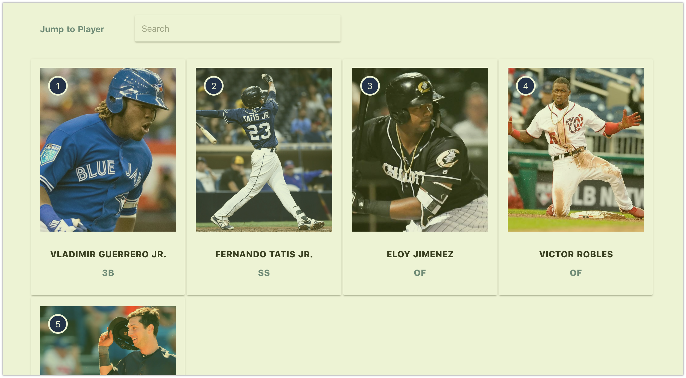

# easy-prospect-watch



[MLB.com Prospect Watch](http://m.mlb.com/prospects)ライクなプロスペクトリストを作ることが出来るアプリです。

# ユーザー向けガイド

## ウェブアプリケーション

+ [easy-prospect-watch](https://easy-prospect-watch.firebaseapp.com/)

## How to use

1. "UPLOAD YOUR RANKING!" ボタンをクリックします。
2. プロスペクトランキングのCSVをアップロードします。
3. ロード・加工処理が成功した場合、プロスペクトランキングが表示されます。

## CSVレイアウト

CSVレイアウトの例です。

```csv
name,team,pos,rank,image,description
VLADIMIR GUERRERO JR.,TOR,3B,1,https://assets3.sportsnet.ca/wp-content/uploads/2018/03/guerrero_vladjr1280-1040x572.jpg,Amazing!
FERNANDO TATIS JR.,SD,SS,2,https://cdn-images-1.medium.com/max/1600/1*9-RvXHUlsMa9KkEvwNS-EQ.jpeg,Amazing!
ELOY JIMENEZ,CWS,OF,3,http://images.performgroup.com/di/library/sporting_news/e/a0/eloyjimenez-062218-ftr-gettyjpg_uj2x9df2847x1p20hixucbjop.jpg?t=667829276&w=960&quality=70,Amazing!
VICTOR ROBLES,WSH,OF,4,https://imagesvc.timeincapp.com/v3/fan/image?url=https%3A%2F%2Fdistrictondeck.com%2Fwp-content%2Fuploads%2Fgetty-images%2F2017%2F07%2F1038899232.jpeg&c=sc&w=850&h=560,Amazing!
KYLE TUCKER,HOU,OF,5,https://imagesvc.timeincapp.com/v3/fan/image?url=https://houseofhouston.com/wp-content/uploads/getty-images/2018/03/928216584-houston-astros-v-new-york-mets.jpg.jpg&,Amazing!
```

CSVには下記カラムを必ず含んで下さい。カラム順は順不同で問題無しです。

| Name        | About                  |
|:----------- |:---------------------- |
| name        | 選手名                 | 
| team        | チーム名               |
| pos         | ポジション名           |
| rank        | ランキング             |
| description | スカウティングレポート |
| image       | 画像URL                |

# 開発者向けガイド

## Getting Started

``` bash
# clone repository
$ git clone https://github.com/prs-watch/easy-prospect-watch.git easy-prospect-watch
# move into project
$ cd easy-prospect-watch
# install dependencies
$ npm install
# run
$ npm run dev
# generate static resources
$ npm run generate
```
